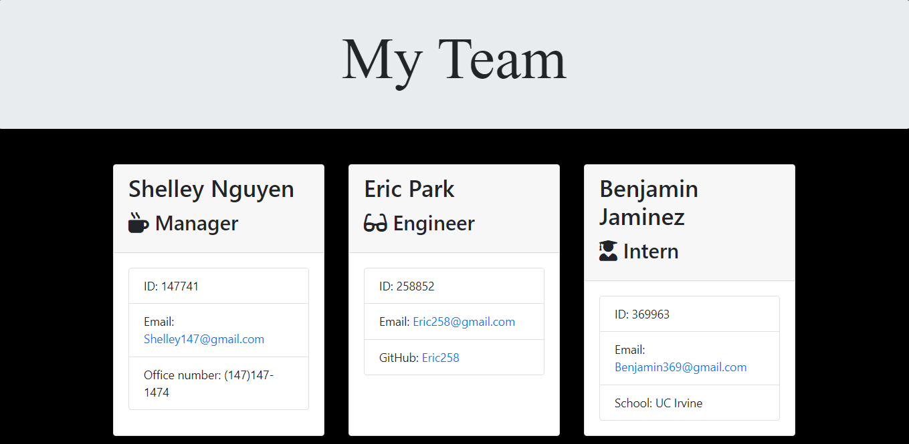

# Team Profile Generator
### Welcome to my "Team Profile Generator"

## Discription:
The user will be asked to input team members' basic information and their positions in the team: manager, engineer, or intern.
Then the nodejs application will display your team members' basic information, along with quick access to their email and github profile.
The application uses:
- npm inquirer: to interact with users
- npm jest: to run tests

## Installation
1. Clone the folder from github
2. In the terminal, run the command "npm i"
3. To run the application, run the command "node app.js"

## Tests
The application uses npm jest for tests. Therefore, run the command "npm run test" to test the application.

## Questions
Find me on github: [bnguyen467](https://github.com/bnguyen467)
 
Contact me through email: 467bnguyen@gmail.com

### This is how the application looks like in the VS Code terminal
**Follow the link to the video for more details:** https://www.youtube.com/watch?v=IGQ_98Q1VLA&feature=youtu.be
 

